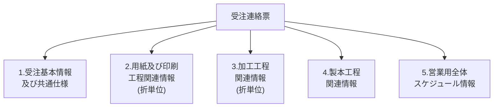

update: June 8, 2017
version: 1.1.0
modified: 20170602打ち合わせ結果反映
---

# WBS-1.1.4 受注連絡票

受注連絡票が本を作るため、必須の流れに従って、5つ種類の情報をまとめて作成してきました。

ここから各種類の情報毎に説明させていただきます。

## 1）基本情報

PageHeader にしてください。

### 入出力関係

~~※1　背景色が黄色である行がまだ確認必要なので、一時空白にしてください。~~
※2　赤字の項目が他のテーブルを参照してから、漢字名（名所）を印字してください。
---
## 2）用紙及び印刷工程関連情報

Detail にしてください。１つの折情報を１行で印字（行数可変）
<b>折情報が５行未満の場合、空白行を追加してください。<b>

### 入出力関係

~~※1　背景色が黄色である行がまだ確認必要なので、一時空白にしてください。~~
※2　赤字の項目が他のテーブルを参照してから、漢字名（名所）を印字してください。
---
## 3）加工工程関連情報

Detail にしてください。折情報より、加工情報を取得してから、１つの加工情報を１行で印字（行数可変）
※　１つの折情報にはMax 3つの加工情報が存在可能です。
<b>加工情報が５行未満の場合、空白行を追加してください。<b>

### 入出力関係

---
## 4）製本工程情報

Detail にしてください。受注情報より、製本情報を取得してから、１つの製本情報を１行で印字（行数可変）
<b>製本情報が５行未満の場合、空白行を追加してください。<b>

### 入出力関係

~~※1　背景色が黄色である行がまだ確認必要なので、一時空白にしてください。~~
※2　赤字の項目が他のテーブルを参照してから、漢字名（名所）を印字してください。
---
## 5）営業用全体スケジュール情報

Detail にしてください。１回６週間の全体スケジュール情報を表示します。
６週間以上のスケジュールが存在すれば、上記イメージのように複数回繰り返し印字します。

### 入出力関係

---
## 6）備考欄

Detail にしてください。受注情報より備考を印字します。

※【2017/06/08　追記】画面に入力際に、ユーザーが改行なども入力していましたので、
この改行より、画面印字してください。<b>ユーザー入力の内容が５行未満の場合、空白行を追加してください。<b>

---
## 7）その他

Footer にしてください。固定印字します。

----
#### 参照資料
* 現行システム
* user0022_受注連絡票_GOD比較20150827B
* 受注連絡票項目データ詳細
* エンティティ一定義書
* 【受注連絡票】Q&A台帳_20170606
