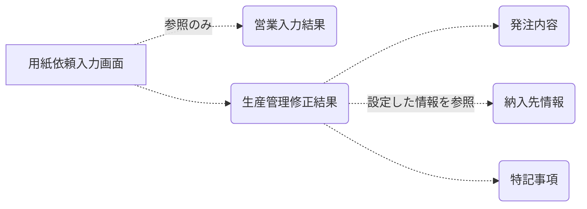
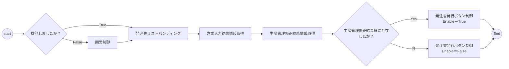
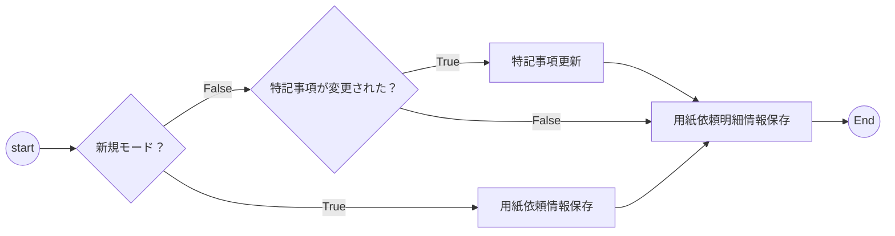

# WBS-2.3.1 用紙依頼入力詳細設計

## <font color=#1B4F72>１）概要</font>

##### システムフロー（画面遷移図）


##### 画面概要
---


---
用紙依頼入力画面は、営業入力結果と生産管理修正結果の２つ種類情報を表示します。生産管理修正情報ですが、発注内容と納入先情報を含めます。そして、依頼先への特記事項も設定できます。


営業の方が受注入力画面（fCP0004）と折入力画面（fCP0005）に設定した用紙関連情報を営業入力結果に表示されます。~~<font color=red>ここで普通、折単位で情報を表示しますが、もしかしたら、折情報からデータを取得できない場合、受注情報からデータを取得します。</font>~~

生産管理の方が上記の営業入力結果情報を参照してから、用紙銘柄単位で依頼情報を設定します。<font color=red>用紙銘柄毎に複数の納入先が存在することをご注意ください。</font>

---
　　**銘柄（めいがら）とは**
　　　　①ブランドのこと
　　　　②証券取引所に上場している株式の企業名のこと（株式銘柄）
---

##### 関連テーブル情報


## <font color=#1B4F72>2）I/O関係定義</font>

##### 2.1 共通エリア

---
###### イメージ


---
###### UI定義
| 順番 	| 項目名 	| 属性 	| ReadOnly 	| データ元 	| 仕様 	|
|------	|------------------	|----------	|----------	|--------------------------------------------------------	|------------------------------------------------------------------------------------------------	|
| 1-1 	| 年度 	| テキスト 	| ○ 	|  	| 前画面から渡す年度 	|
| 1-2 	| 題名 	| テキスト 	| ○ 	|  	| 前画面から渡す題名 	|
| 1-3 	| 号数 	| テキスト 	| ○ 	|  	| 前画面から渡す号数 	|
| 1-4 	| 受注管理番号 	| テキスト 	| ○ 	|  	| 前画面から渡す受注管理番号 	|
| 1-5 	| 発注先 	| コンボボックス 	| ○ 	| ・依頼先情報.依頼先コード・VIEW_MST_CLIENT.CLIENT_NAME 	| ・用紙依頼先である会社名でバインディング・選択されたアイテムがしたら、生産管理結果エリアを切替 	|
| 1-6 	| 参照モードラベル 	| ラベル 	| ○ 	|  	| 排他処理で制御 	|


> <b><u>発注先取得SQL</u></b>
SELECT C.CLIENT_CODE,C.CLIENT_NAME
FROM
PMT_DELIVERY D,VIEW_MST_CLIENT C
WHERE   D.REC_ORDER_SEQ_NO=<font color=red>:受注管理番号</font>
  AND D.DATA_DIV <> '1'  AND D.DELIVERY_DIV_PAPER = '1'
AND C.CLIENT_CODE=D.DELIVERY_COMPANY_CD

##### 2.2 営業入力結果エリア

---
###### イメージ


---
###### UI定義
| 項番 	| 項目名 	| 属性 	| ReadOnly 	| データ元 	| 仕様 	|
|------	|----------------	|----------------	|----------	|------------------------	|------------------------------------------------------------------------------------------	|
| 2-1 	| 最終更新日 	| ラベル 	| ○ 	| PMT_FOLD.LAST_DATE 	| 折情報の最終更新日をソートしてから、一番大きい日付になる情報より、YYYY/MM/DDの形式で印字 	|
| 2-2 	| 最終更新担当者 	| ラベル 	| ○ 	| PMT_FOLD.LAST_USER_CD 	| 折情報の最終更新日をソートしてから、一番大きい日付になる情報より、担当者名を印字 	|
| 2-3 	| 折名 	| テキスト 	| ○ 	| PMT_FOLD.FOLD_NAME 	|  	|
| 2-4 	| 用紙区分 	| コンボボックス 	| ○ 	| PMT_FOLD.PAPER_DIV_CD 	| 用紙区分ＣＤで汎用マスタより用紙区分を取得してから、印字 	|
| 2-5 	| 用紙名 	| テキスト 	| ○ 	| PMT_FOLD.PAPER_NAME 	|  	|
| 2-6 	| 代理店 	| テキスト 	| ○ 	| PMT_FOLD.PAPER_CD 	| 折情報の用紙コードで用紙マスタより代理店名を取得してから、印字 	|
| 2-7 	| サイズ 	| テキスト 	| ○ 	| PMT_FOLD.PAPER_SIZE 	|  	|
| 2-8 	| 使用本数 	| テキスト 	| ○ 	| PMT_FOLD.USE_NUM 	|  	|
| 2-9 	| 指定連数 	| テキスト 	| ○ 	| PMT_FOLD.SPECIFY_ROLL 	|  	|
| 2-10 	| 過不足 	| テキスト 	| ○ 	| PMT_FOLD.REMAINDER_NUM 	|  	|

> <b><u>用紙区分取得SQL</u></b>
SELECT C.CD,C.VALUE1 FROM PMM_COMMON C
WHERE C.CD_NO='0020'
AND C.CD<>'!!!!'


##### 2.3 生産管理修正エリア
---
###### イメージ


---
###### UI定義
| 項番 	| 項目名 	| 属性 	| ReadOnly 	| データ元 	| 仕様 	|
|------	|----------------	|----------------	|:--------:	|---------------------------------------------------	|---------------------------------------------------------------------------------------------------------------------------------------------------------	|
| 3-1 	| 最終更新日 	| ラベル 	| ○ 	| PMT_PAPER_ORDER.LAST_DATE 	| 用紙依頼情報の最終更新日をソートしてから、一番大きい日付になる情報より、YYYY/MM/DDの形式で印字  初期値：空白 	|
| 3-2 	| 最終更新担当者 	| ラベル 	| ○ 	| PMT_PAPER_ORDER.LAST_USER_CD 	| 上記のレコードより、ユーザー名を表示  初期値：空白 	|
| 3-3 	| 伝票NO 	| テキスト 	| ○ 	| PMT_ORDER_PAPER_DETAIL.PAPER_ORDER_DETAIL_NO 	| 入力順位で1から連番で設定 	|
| 3-4 	| 用紙名 	| コンボボックス 	|  	| PMT_ORDER_PAPER_DETAIL.PAPER_CD 	| 用紙マスタより用紙名を取得してから、バンディング  初期値：空白 	|
| 3-5 	| 寸法 	| テキスト 	|  	| PMT_ORDER_PAPER_DETAIL.PAPER_CD 	| 用紙コードで用紙マスタより巾と横を取得してから、巾*横の形式で印字  初期値：空白 　　　　用紙名を設定したら、指定された用紙情報より、巾*横を設定します。 	|
| 3-6 	| 流目 	| コンボボックス 	|  	| PMT_ORDER_PAPER_DETAIL.PAPER_ORDER_GRAIN 	| 汎用マスタより流目区分を取得してから、バンディング 	|
| 3-7 	| 連量 	| テキスト 	|  	| PMT_ORDER_PAPER_DETAIL.PAPER_CD 	| 用紙コードで用紙マスタよりＲ数を取得してから、印字  初期値：空白,用紙名を設定したら、指定された用紙情報より、Ｒ数を設定します。 	|
| 3-8 	| 数量 	| テキスト 	|  	| PMT_ORDER_PAPER_DETAIL.PAPER_ORDER_MOUNT 	|コンマ編集  	|
| 3-9 	| 単位 	| テキスト 	|  	| PMT_ORDER_PAPER_DETAIL.PAPER_ORDER_UNIT 	|  	|
| 3-10 	| 断裁 	| コンボボックス 	|  	| PMT_ORDER_PAPER_DETAIL.PAPER_ORDER_CUTTING_METHOD 	| 汎用マスタより断裁方法を取得してから、バンディング 	|
| 3-11 	| 納期 	| 日付 	|  	| PMT_ORDER_PAPER_DETAIL.PAPER_ORDER_DELIVERY_DATE 	| 「YY/MM/DD」の形式で表示 	|
| 3-12 	| 納入先 	| コンボボックス 	|  	| PMT_ORDER_PAPER_DETAIL.PAPER_ORDER_DELIEVERY_CD 	| 依頼先情報より、納入先区分が印刷である会社名を取得してから、バンディング 	|
| 3-13 	| 備考 	| テキスト 	|  	| PMT_ORDER_PAPER_DETAIL.PAPER_ORDER_COMMENT 	|  	|

<font color=red>※用紙名を選択されたら、3-5、3-7も自動的に設定します。ただし、3-5、3-7の値が空白以外の場合、設定しません。</font>

編集されたセルがValidatedイベントで下記のエラーチェックを行います。
　・長さチェック（テキスト項目のみ）
　・必須チェック(用紙名、納期、納入先)


## <font color=#1B4F72>3）使用シナリオ</font>


```yUML
[https://yuml.me/diagram/scruffy/usecase/draw]

[Customer]-(1. 依頼情報表示)
(1. 依頼情報表示)>(1.3 生産管理修正結果取得)
(1. 依頼情報表示)>(1.2 営業入力結果取得)
(1. 依頼情報表示)>(1.1 排他処理)
[Customer]-(2. 依頼情報編集)
(2. 依頼情報編集)>(2.1 情報追加)
(2. 依頼情報編集)>(2.2 情報変更)
(2. 依頼情報編集)>(2.3 情報削除)
[Customer]-(3. 依頼情報保存)
```

###### 3.1 依頼情報表示

受注入力画面（fCP0004）で、「設計（生産管理）」ボタンを押したら、発注先設計画面に遷移します。

画面開くと、下記のフローで処理します。

**排他処理**
他の画面と同じ、画面IDと受注管理番号でロックを追加します。
排他処理が失敗である場合、「1-6 参照モードラベル」を表示になり、「登録」ボタンも押せないように制御します。

**発注先リストバンディング**
依頼先情報より、納入先区分が用紙である、有効なレコード取得し、発注先リストへバンディングします。
```
DisplayMember＝ 取引先名（依頼先コードでVIEW_MST_CLIENTから取得）
ValueMember  ＝ 依頼先コード
```
**営業入力結果取得**
画面表示処理で指定受注管理番号と関連する有効な折情報より、用紙情報を取得します。折情報にはMAX５つの用紙情報が存在しますから、ご注意ください。

**生産管理修正結果取得**
初期登録者、登録部署、登録日時、最終更新者、更新部署、更新日時も取得します。

###### 3.2 依頼情報編集
ユーザーが営業入力結果を参照しながら、銘柄・納入先毎に、用紙依頼情報を設定します。
設定した情報を一時メモリに格納しております。

* **「行挿入」**を押したら、選択状態になる行の直前に行を追加します。
* **「行追加」**を押したら、明細部の最後に行を追加します。
* **「行削除」**を押したら、選択状態になる行を削除します。

###### 3.3 依頼情報登録
Tab切替＆「登録」ボタンを押した場合、もし変更があれば、依頼情報の登録を発生します。（参照モード以外）
編集した生産管理修正情報を下記のフォローでDBへ保存します。

**新規モード**
「3.1 依頼情報表示」処理には、もし生産管理修正結果情報が０件であれば、新規モードと見なします。

**用紙依頼明細情報保存**
　①先に既存のデータを削除します。
　②画面から渡す用紙依頼明細情報を最終更新者と最終更新日時を一括修正します。
　③修正した結果をDBに挿入します。

###### 3.4 依頼情報削除
略
~~納入依頼タブを押したら、依頼先入力画面へ遷移します。
この画面で、生産管理修正結果から選択した依頼先情報を削除します。~~

## <font color=#1B4F72>4）データマッピング</font>

###### 4.1 用紙依頼情報
【PMT_ORDER_PAPER】マッピング
| No 	| フィールド名称 	| フィールドID 	| 内容 	|
|----	|------------------	|---------------------	|----------------------------------------	|
| 1 	| 受注管理番号 	| REC_ORDER_SEQ_NO 	| 共通エリアの受注管理番号 	|
| 2 	| 依頼先コード 	| DELIVERY_COMPANY_CD 	| 発注リストに選択された会社ＣＤ 	|
| 3 	| 用紙依頼特記事項 	| PAPER_ORDER_MEMO 	| 生産管理エリアの「特記事項」 	|
| 4 	| データ区分 	| DATA_DIV 	| 「0」を固定設定 	|
| 5 	| 初期登録日時 	| FIRST_DATE 	| 用紙依頼情報の初期登録日時を設定 	|
| 6 	| 初期登録者部門CD 	| FIRST_DEPT_CD 	| 用紙依頼情報の初期登録者部門ＣＤを設定 	|
| 7 	| 初期登録者CD 	| FIRST_USER_CD 	| 用紙依頼情報の初期登録者ＣＤを設定 	|
| 8 	| 最終更新日時 	| LAST_DATE 	| Sysdate 	|
| 9 	| 最終更新者部門CD 	| LAST_DEPT_CD 	| ログインしているユーザの部署CD 	|
| 10 	| 最終更新者CD 	| LAST_USER_CD 	| ログインしているユーザCD 	|

###### 4.2 用紙依頼詳細情報
【PMT_ORDER_PAPER_DETAIL】マッピング
| No 	| フィールド名称 	| フィールドID 	| 内容 	|
|----	|----------------------	|----------------------------	|-----------------------------------------	|
| 1 	| 受注管理番号 	| REC_ORDER_SEQ_NO 	| 共通エリアの受注管理番号 	|
| 2 	| 依頼先コード 	| DELIVERY_COMPANY_CD 	| 発注リストに選択された会社ＣＤ 	|
| 3 	| 用紙依頼伝票no 	| PAPER_ORDER_DETAIL_NO 	| 1から連番設定 	|
| 4 	| 用紙コード 	| PAPER_CD 	| 生産管理エリアの「用紙名」リストのValue 	|
| 5 	| 用紙依頼数量 	| PAPER_ORDER_MOUNT 	| 生産管理エリアの「数量」 	|
| 6 	| 用紙依頼単位 	| PAPER_ORDER_UNIT 	| 生産管理エリアの「単位」 	|
| 7 	| 用紙依頼流目 	| PAPER_ORDER_GRAIN 	| 生産管理エリアの「流目」のValue 	|
| 8 	| 用紙依頼断裁方法 	| PAPER_ORDER_CUTTING_METHOD 	| 生産管理エリアの「断裁」のValue 	|
| 9 	| 用紙依頼納期 	| PAPER_ORDER_DELIVERY_DATE 	| 生産管理エリアの「納期」のValue 	|
| 10 	| 用紙依頼納入先コード 	| PAPER_ORDER_DELIEVERY_CD 	| 生産管理エリアの「納入先」のValue 	|
| 11 	| 用紙依頼備考 	| PAPER_ORDER_COMMENT 	| 生産管理エリアの「備考」 	|
| 12 	| データ区分 	| DATA_DIV 	| 「0」を固定設定 	|
| 13 	| 初期登録日時 	| FIRST_DATE 	| 用紙依頼情報の初期登録日時を設定 	|
| 14 	| 初期登録者部門CD 	| FIRST_DEPT_CD 	| 用紙依頼情報の初期登録者部門ＣＤを設定 	|
| 15 	| 初期登録者CD 	| FIRST_USER_CD 	| 用紙依頼情報の初期登録者ＣＤを設定 	|
| 16 	| 最終更新日時 	| LAST_DATE 	| Sysdate 	|
| 17 	| 最終更新者部門CD 	| LAST_DEPT_CD 	| ログインしているユーザの部署CD 	|
| 18 	| 最終更新者CD 	| LAST_USER_CD 	| ログインしているユーザCD 	|
