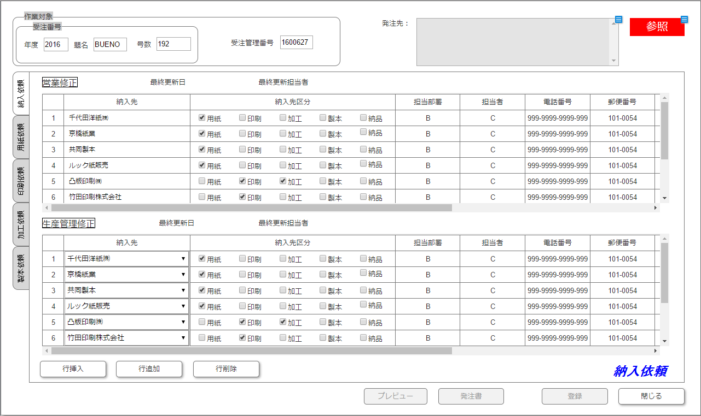
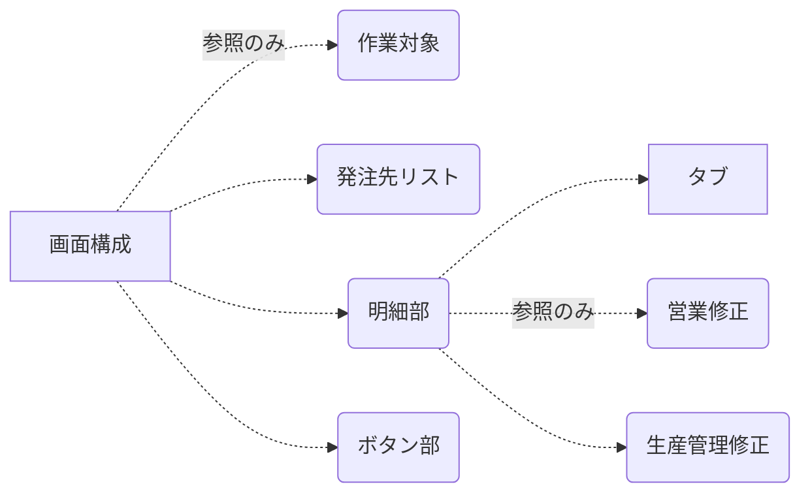
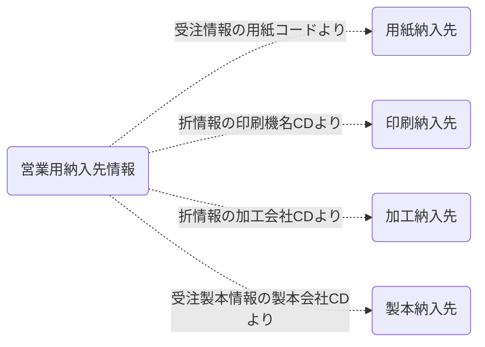
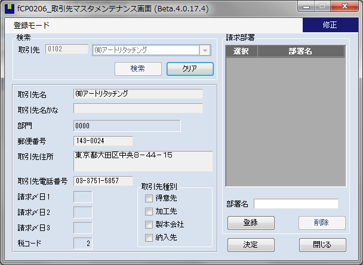
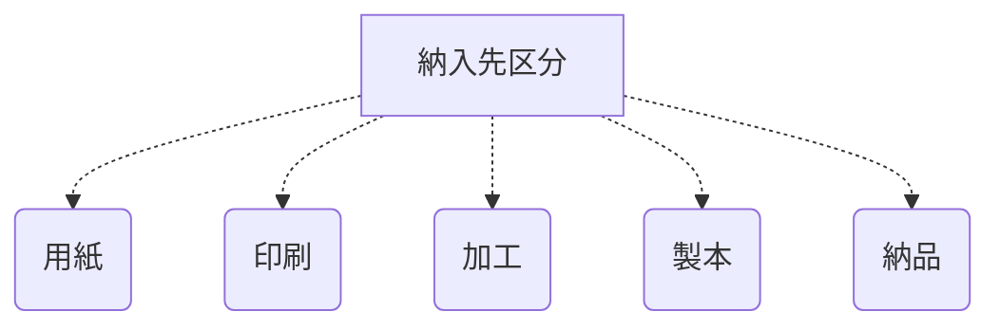
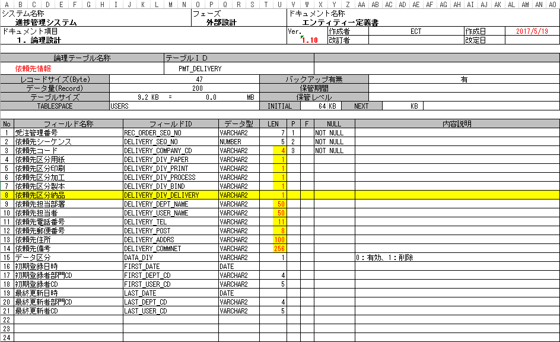

---
update: May 19,2017
author: Tony Wang
version: 1.0.1
modified:
　    ①　2）画面構成　イメージ「F4.2-4 情報取得元」を追加しました。
　    ②　4）データベース定義が更新しました。
  　  ③　5）画面編集　新規モードでの情報コピーについて、用紙会社も対象外になります。
---
# WBS-4 発注先設計画面
#### 機能概要
現行にある受注画面と折画面が製造仕様を入力する画面として、生産管理用の依頼実績情報が発注先設計画面を新規作成します。
発注先設計画面が受注を生産するため、各工程依頼情報をべつべつで設定、そして各工程の納入先情報もここで紐つけます。
> 起動
 >>受注入力画面（fCP0004）に「設計（生産管理）」ボタンを押したら、発注先設計画面を表示します。
**受注入力画面から受注管理番号が渡すことが必要です！**
画面起動の際に排他処理を実行することが必要となります。他の画面と同じ、排他状態であれば、画面を参照モードで表示します。
---
#### WBS-4.2 依頼先入力画面
各工程の依頼先と納入先の情報をまとめてこの画面で設定します。

##### 1）画面イメージ

##### 2）画面構成

* この画面には、「プリビュー」ボタン、「発注書」ボタンが使えないです。
* 画面の右上にある**発注先リスト**がクリアしてください。
* 明細部の営業修正について、下記のように情報を取得します。（※納入先情報を重複する場合、1レコードに集約）

※営業修正の明細について、納品である納入先は抽出できない

##### 3）明細部の項目

>【納入先】
>
C1.Win.C1List.C1Comboです。
Itemの内容が取引先マスタから情報取得します。

>【納入先区分】
>
納入先区分が工程別で分けます。
CheckBoxで表現します。

>【その他】

項目名   | 編集方法 | ディフォルト値
---------|----------|---------------
担当部署 | 手入力   | 自動設定
担当者   | 手入力   | 空白
電話番号 | 手入力   | 自動設定
郵便番号 | 手入力   | 自動設定
住所     | 手入力   | 自動設定
備考     | 手入力   | 空白

##### ４）データベース定義

#### 5）画面編集

>新規モード

* 生産管理修正結果がないので、営業修正結果をそのままコピーして設定します。(用紙会社と印刷会社は対象外)

>修正モード&削除モード

* 特殊の操作がなし

>参照モード
* 特殊の操作がなし
