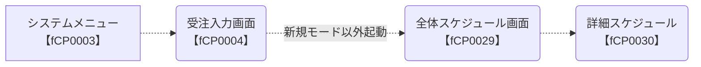
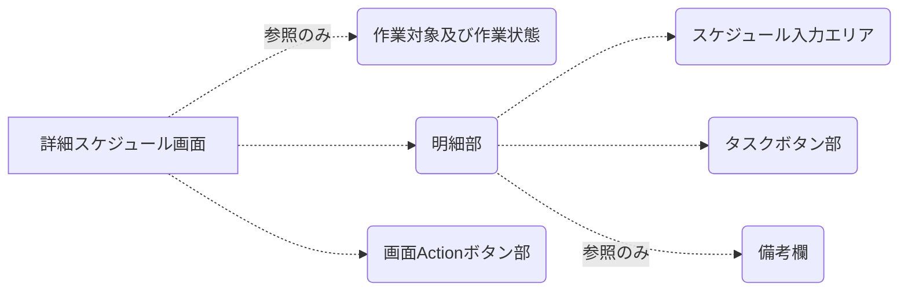
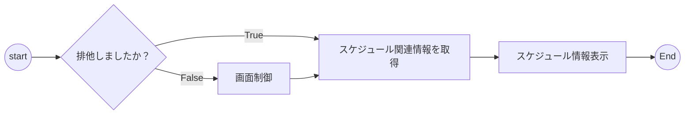

# WBS-5.1 詳細スケジュール画面詳細設計

## <font color=#1B4F72>１）概要</font>

##### システムフロー（画面遷移図）



##### 画面概要
---


---
生産管理担当者はこの画面には営業担当が入力した全体スケジュールを参照しながら、
実際の生産計画を作成します。

* 効率的なタスク設定機能を実装します。

* 動態的な日付の列を追加する機能を実装します。

* 折情報以外の生産情報も記入するため、行追加機能と行削除機能を実装します。




##### 1.1 スケジュール情報の種類
明細部に３種類のスケジュール情報があります。


* <u>参照用全体スケジュール</u>

>営業担当が全体スケジュール画面に入力した内容です。
>この画面には参照のみになります。

* <u>折生産スケジュール</u>

>生産管理担当者がこのエリアで生産用スケジュールを打ち立てします。
> 品名欄に備考内容を入力します。
> 折名～印刷所の情報が折情報より取得して表示します。（参照のみ）

* <u>カスタマイズスケジュール</u>

>折情報以外の印刷品があれば、カスタマイズスケジュールを運用し、
> 管理できるようになります。
> 品名欄に備考内容を入力します。
> 折名～頁数まで１セルにマージして、印刷品の名前を入力可能です。
> 色数～印刷所まで１セルにマージして、印刷品の補充文言を入力可能です。

---
###### 運用イメージ


##### 1.2　関連テーブル情報


## <font color=#1B4F72>2）I/O関係定義</font>

##### 2.1　共通エリア
---
###### イメージ


---
###### UI定義
| 順番 	| 項目名 	| 属性 	| ReadOnly 	| データ元 	| 仕様 	|
|------	|------------------	|----------	|----------	|--------------------------------------------------------	|------------------------------------------------------------------------------------------------	|
| 1-1 	| 年度 	| テキスト 	| ○ 	|  	| 前画面から渡す年度 	|
| 1-2 	| 題名 	| テキスト 	| ○ 	|  	| 前画面から渡す題名 	|
| 1-3 	| 号数 	| テキスト 	| ○ 	|  	| 前画面から渡す号数 	|
| 1-4 	| 受注管理番号 	| テキスト 	| ○ 	|  	| 前画面から渡す受注管理番号 	|
| 1-5 	| 参照モードラベル 	| ラベル 	| ○ 	|  	| 排他処理で制御 	|

##### 2.2 明細部エリア

---
###### イメージ
（略）

---
###### UI定義【参照用全体スケジュール】
| 順番 | 項目名   | 属性     | ReadOnly | データ元               | 仕様 |
|------|----------|----------|----------|------------------------|------|
| 2-1  | 品名     | テキスト | ○        | PMT_REC_ORDER.TITLE_KJ | 左寄せ
| 2-2  | 折       | テキスト | ○        |                        | 空白 |
| 2-3  | 規格     | テキスト | ○        |                        | 空白 |
| 2-4  | 頁数     | テキスト | ○        |                        | 空白 |
| 2-5  | 色数     | テキスト | ○        |                        | 空白 |
| 2-6  | 印刷方式 | テキスト | ○        |                        | 空白 |
| 2-7  | 印刷所   | テキスト | ○        |                        | 空白 |

###### UI定義【折生産スケジュール】
| 順番 | 項目名   | 属性     | ReadOnly | データ元                      | 仕様   |
|------|----------|----------|----------|-------------------------------|--------|
| 2-1  | 品名     | テキスト |          | PMT_SCHEDULE_CUSTOMIZE.SCHEDULE_REMARKS | 右寄せ |
| 2-2  | 折       | テキスト | ○        | PMT_FOLD.FOLD_NAME            |        |
| 2-3  | 規格     | テキスト | ○        | PMT_FOLD.STANDARD_CD          |        |
| 2-4  | 頁数     | テキスト | ○        | PMT_FOLD_PAGE.PAGE_NUM        |        |
| 2-5  | 色数     | テキスト | ○        | PMT_FOLD.COLOR_NUM            |        |
| 2-6  | 印刷方式 | テキスト | ○        | PMT_FOLD.PRESS_DIV_CD         |        |
| 2-7  | 印刷所   | テキスト | ○        | PMT_FOLD.PRESS_NAME_CD        |        |
###### UI定義【カスタマイズスケジュール】

| 順番 | 項目名   | 属性     | ReadOnly | データ元                              | 仕様                 |
|------|----------|----------|----------|---------------------------------------|----------------------|
| 2-1  | 品名     | テキスト |          | PMT_SCHEDULE_CUSTOMIZE.SCHEDULE_REMARKS         | 右寄せ               |
| 2-2  | 折       | テキスト |          | PMT_SCHEDULE_CUSTOMIZE.SCHEDULE_NAME1 | 1-2～1-4をセルマージ |
| 2-3  | 規格     | テキスト |          |                                       | 1-2～1-4をセルマージ |
| 2-4  | 頁数     | テキスト |          |                                       | 1-2～1-4をセルマージ |
| 2-5  | 色数     | テキスト |          | PMT_SCHEDULE_CUSTOMIZE.SCHEDULE_NAME2 | 1-5～1-7をセルマージ |
| 2-6  | 印刷方式 | テキスト |          |                                       | 1-5～1-7をセルマージ |
| 2-7  | 印刷所   | テキスト |          |                                       | 1-5～1-7をセルマージ |

###### UI定義【折生産スケジュール】

| 順番 | 項目名 | 属性     | ReadOnly | データ元                       | 仕様 |
|------|--------|----------|----------|--------------------------------|------|
| 2-8  | 備考   | テキスト | 〇       | PMT_REC_ORDER.REC_ORDER_REMARK |      |

## <font color=#1B4F72>3）使用シナリオ</font>


```yUML
[https://yuml.me/diagram/scruffy/usecase/draw]

[Customer]-(1.スケジュール表示＆設定)
[Customer]-(2.カスタマイズスケジュール管理)
[Customer]-(3.日付追加)
[Customer]-(4.詳細スケジュール登録)
(1.スケジュール表示＆設定)>(1.3 カスタマイズスケジュール表示)
(1.スケジュール表示＆設定)>(1.2 折情報＆スケジュール表示)
(1.スケジュール表示＆設定)>(1.1 参照用全体スケジュール表示)
(2.カスタマイズスケジュール管理)>(2.2 行削除)
(2.カスタマイズスケジュール管理)>(2.1 行追加)
```

###### 1 スケジュール表示＆設定

全体スケジュール画面（fCP0029）で、「詳細スケジュール」ボタンを押したら、詳細スケジュール画面に遷移します。

画面開くと、下記のフローで処理します。

**排他処理**
他の画面と同じ、画面IDと受注管理番号でロックを追加します。
排他処理が失敗である場合、「1-5 参照モードラベル」を表示になり、「登録」ボタンも押せないように制御します。

**スケジュール設定**
<font color=red>スケジュール設定エリアに参照用スケジュール行のみ編集不可</font>

先にタスクボタン部で設定したい内容を選択します。
そして、スケジュール設定エリアのセルにクリックしてから、選択した内容が自動的に設定されます。（セルも手入力で内容変更できます。）
セルに既存内容があれば、Confirmでユーザーに内容をきりかえるかどうかを確認必要となります。

削除状態（「削除」ボタンが選択状態になること）でメッセージを表示しなくて内容を削除します。

カスタマイズの場合、カスタマイズボタンの直後のテキストボックスにある内容で設定されます。

###### 2 カスタマイズスケジュール管理
明細部に一番下の折生産スケジュールの下にカスタマイズスケジュールの編集エリアとなります。

* **「行追加」**を押したら、明細部の最後に行を追加します。
* **「行削除」**を押したら、選択状態になるカスタマイズスケジュール行を削除します。（カスタマイズスケジュール行以外、行削除処理を無視してください。）

###### 3 日付追加
サンプルを参照してください。

###### 4 詳細スケジュール登録
【スケジュール情報テーブルの更新】
指定受注管理番号のスケジュール情報にはスケジュール区分が２、３であるレコードを全部削除してから、
画面から渡したデータで挿入します。

<font color=red>※カスタマイズスケジュールの場合、テーブルの折番号列に１からの連番を設定してください。</font>

【スケジュールカスタマイズ情報の更新】
既存なデータを削除してから、挿入します。
