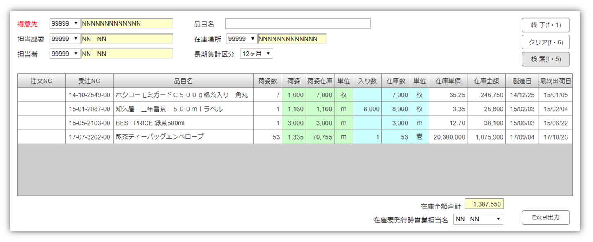
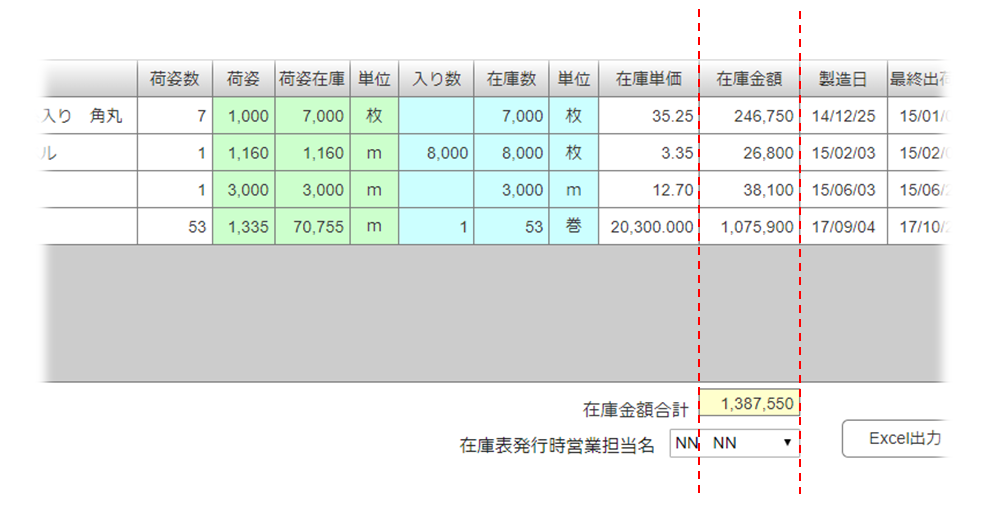

---
ebook:
  title: 在庫表改善説明資料
  authors: Tony Wang
---

# 在庫表改善説明資料

## 概要
在庫表改善ですが、
電脳工場には既に得意先向け在庫表発行機能が存在していますが、これは伊藤園専用の機能です。
今回は
　　1.任意得意先を指定して、在庫表を作成する機能になります。
　　2.長期在庫分も集計し在庫表に記入されます。
　　3.在庫表がExcelで作成してほしいです。

ユーザー資料より在庫表の明細について、見やすいように下記の項目が配置します。

**荷姿別情報**
* 荷姿
* 荷姿数
* 荷姿単位
* 荷姿在庫数

**受注別情報**
※荷姿単位と入り数単位が違う場合のみ、記入します。
* 入り数
* 入り数単位

**金額情報**
* 在庫数
  - 荷姿単位と入り数単位が
 同じ場合、「在庫数 ＝ 荷姿在庫数」
 違う場合、「在庫数 ＝ 入り数 × 荷姿数」
* 在庫単価
* 在庫金額

## 画面設計

### 1.在庫表発行画面

**検索条件**
* 得意先（必須）
* 担当部署
  ディフォルト値はログインユーザーの部署です。
* 担当者
 ディフォルト値がログインユーザーです。
* 品目名
* 在庫場所
* 長期集計区分

**フッター部**
* 在庫表発行時営業担当者
  在庫表に印字する担当者名です。 ディフォルトとして、ログインしているユーザーを設定しております。

* 在庫金額合計

**書式**
* 数量欄、金額欄
	３桁カンマ区切り、整数部のみ
* 単価欄
	３桁カンマ区切り、小数点以下第３位まで
* 日付欄
  yy/mm/dd

### 2.在庫表

在庫日付を指定して検索するのはだめです。電脳工場には在庫検索の場合、必ず今のタイミングの在庫状況を戻りますから。
なので、上部の日付欄がSysdateで印字してください。
