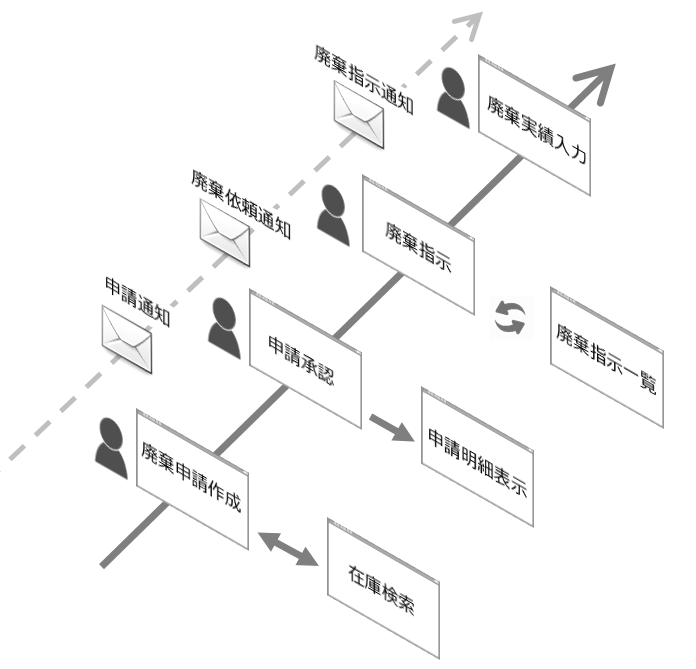
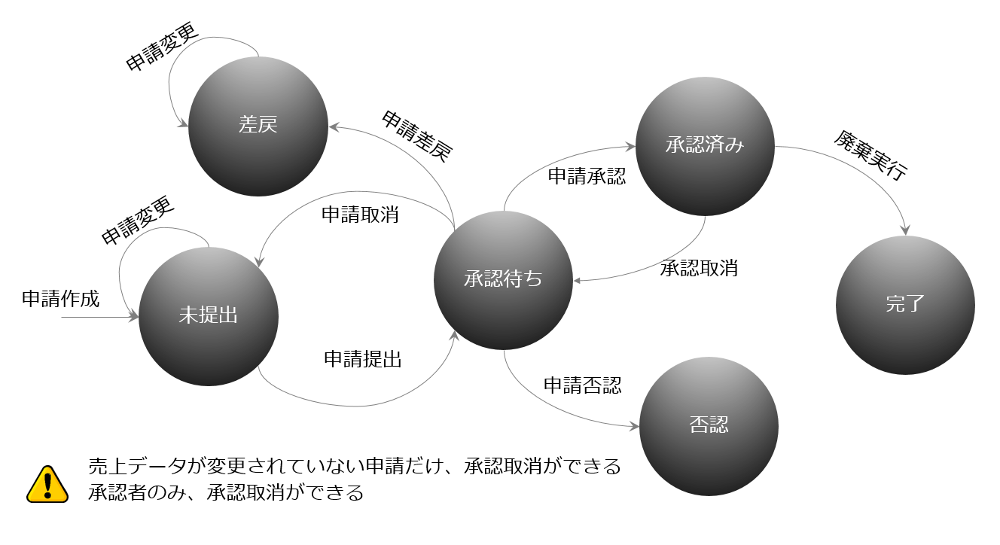
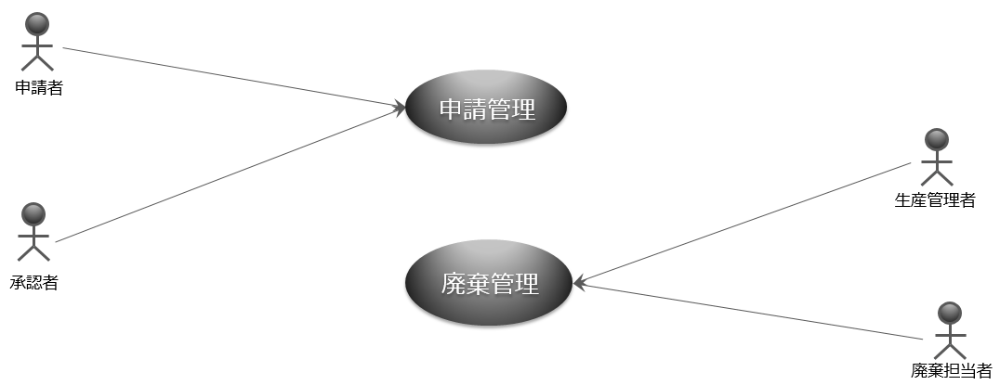
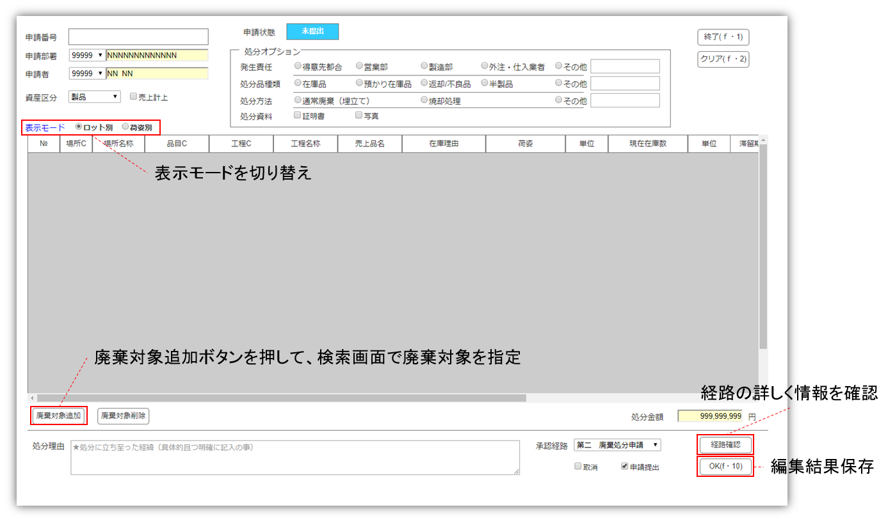
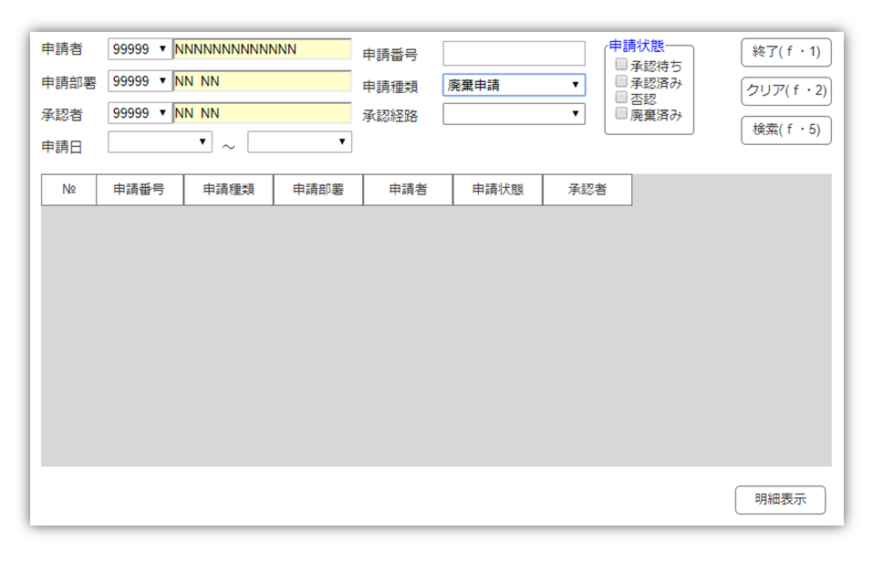
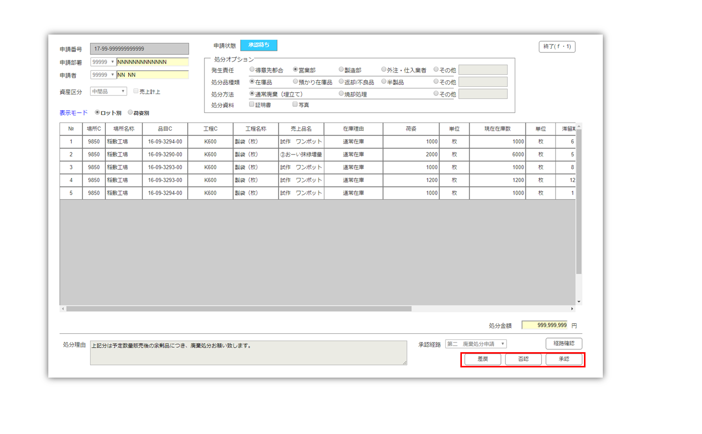
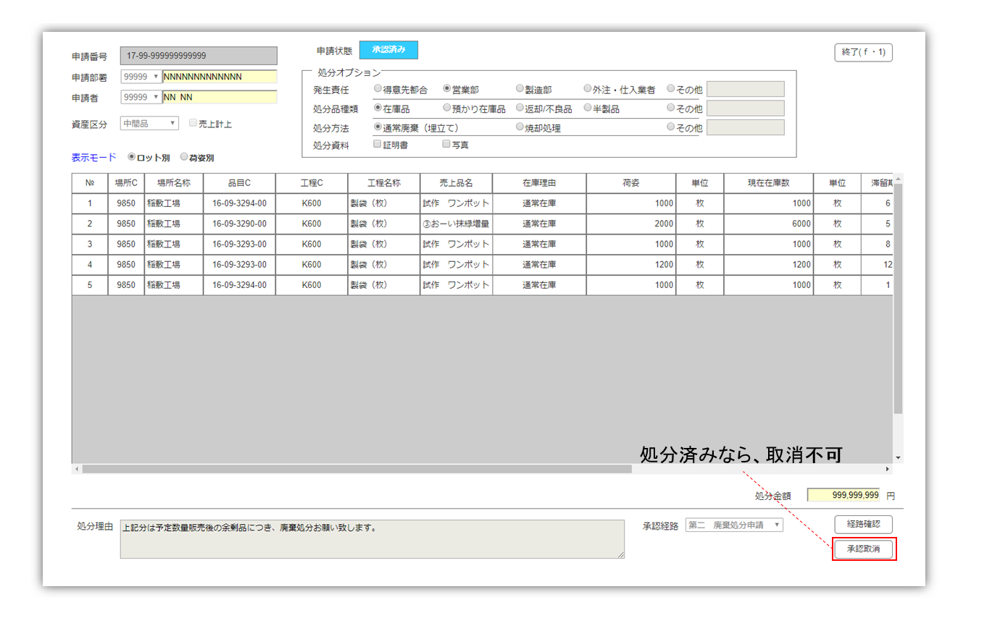
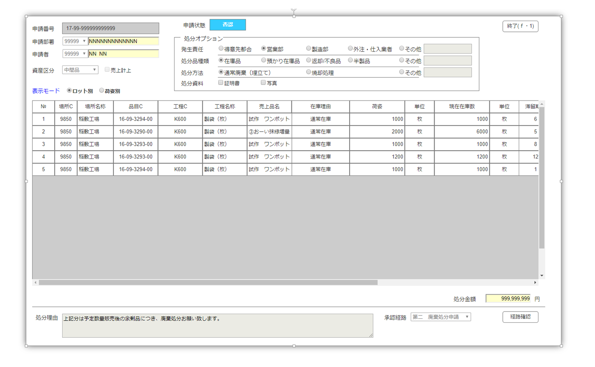
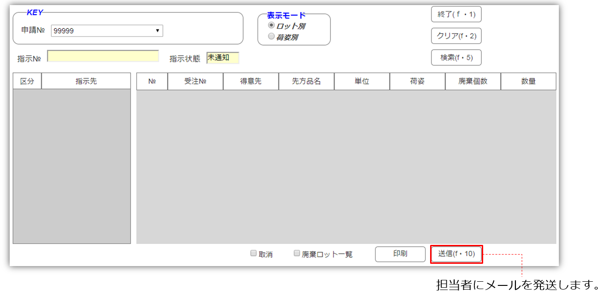
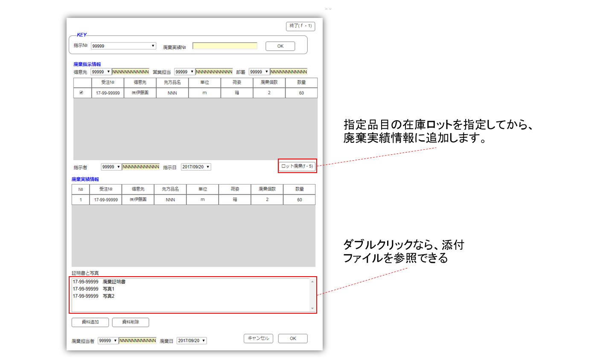

---
ebook:
  title: 廃棄申請処理説明資料
  authors: Tony Wang
---

# 廃棄申請処理説明資料

パッケージ事業部より、電脳工場で伊藤園向け請求書を作成するように希望がありました。
その請求書の内訳明細には廃棄データも記入必要となりますが、現状は電脳工場が廃棄データを管理していませんので、抽出できません。
なので、廃棄処理について、機能を設計して追加になります。
また、伊藤園だけではなくて、全社の共通処理として設計を進めます。

---
## どのような機能ですか？

在庫品がコストとみられるので、任意捨てるのはだめです。なので、
廃棄の実績記録だけではなく、申請＆確認の処理流も必要となりました。
廃棄処理には大体4つステップがあります。

* 廃棄申請
* 廃棄承認
* 廃棄指示
* 廃棄実績入力

### 廃棄申請
申請人が廃棄申請を作成して提出します。
申請人が営業担当だけではなく、生産管理の方も申請できます。

また、廃棄申請には処分関連区分設定、売上計上区分、廃棄対象、処分理由など記入する必要となります。
そして、承認経路の指定も必要となります。

### 廃棄承認
承認者が処理必要な申請を検索し、詳細情報を確認した上で、承認します。
申請の状態が6つあります。

**<u>未提出</u>**
申請を作成し、未提出の状態です。
この状態で、また編集や取消もできます。

**<u>承認待ち</u>**
提出済み、上長の承認を待ち状態です。この状態の申請だけ上長に見れます。
承認者が承認と差戻の操作ができます。そして、申請者より、取消もできます。
承認できない場合、否認します。

**<u>承認済み</u>**
承認者より承認しました状態です。
承認者がこの承認済み状態で承認取消もできます。

**<u>差戻</u>**
申請内容が修正必要なら、一旦差戻するの状態です。
この状態で、申請者が上長のご指摘の内容に従って、修正終わったら、もう一度申請提出します。

**<u>否認</u>**
申請内容が問題あり、承認できない場合、否認します。

**<u>完了</u>**
承認済みなら、廃棄作業を行います。
廃棄実績がシステムに登録したら、この申請が完了の状態になります。

### 廃棄指示
廃棄申請が承認済みなら、廃棄依頼との旨のメールで工場の方に連絡します。
生産管理方が申請のとおり、廃棄指示を作成します。
作成次第、担当者に廃棄指示通知メールを発送します。

### 廃棄実績入力
担当者が廃棄作業を完成したら、実績を電脳工場に登録します。

---
## どの方がこの機能を使いますか？

サブ機能が申請管理と廃棄管理があります。
* 申請管理機能のアクターは**申請者**と**承認者**です。
決裁者が決定できる承認者です。

* 廃棄管理機能のアクターは**生産管理者**と**廃棄担当者**です。
生産管理者が承認済みの廃棄申請を受けて、廃棄指示を出します。
廃棄担当者がその廃棄指示を受けて、廃棄作業を行います。
最後に廃棄実績情報をシステムに登録します。

---
## 使い方の何でしょうか。
この機能が複数の画面を構成されています。
* 申請者向け、申請作成画面
* 承認者向け、申請一覧画面と申請承認画面
* 生産管理向け、廃棄指示作成画面と廃棄指示一覧画面
* 廃棄担当者向け、廃棄実績入力画面

**<u>申請作成画面</u>**

* ログイン情報より申請部署と申請者を設定しております。申請状態が空白です。
申請者の手動で申請区分を設定します。

* 「廃棄対象追加」ボタンを押して、「在庫検索画面」を開きます。
廃棄対象を指定したら、申請作成画面へ戻って、明細部にその対象を表示します。

* 明細部に表示される廃棄対象を選択し、「廃棄対象削除」ボタンを押したら、
選択された明細が廃棄対象外にします。

* 明細部に表示する廃棄対象のコストを合計し、画面の右下に表示します。

* 明細部の表示モードを切り替え設定できます。

* 申請を提出する前に、必ず承認経路を指定します。
承認経路が別のマスタ画面で設定しております。
この場面には、適用な承認経路を指定することができます。
もちろん、承認経路も指定する前に参照できます。

* 申請を提出する際に、合計金額を判断し、決裁者の承認権限を越えれば、
メッセージを表示してから、処理中止にされます。
例えば、合計金額が100万円以上の場合、直接社長のほうに稟議書を提出する旨のメッセージです。

**<u>処分発生責任</u>**
得意先都合、営業部、製造部、外注・仕入業者、その他という区分です。
お客さまより、廃棄するなら、売上計上を行います。（金額が調整する可能性もあります）
その他を選んだ場合、手入力で説明文言を設定できます。

**<u>売上計上区分</u>**
するの場合、売上計上を行います。
しない場合、売上計上を行わないです。

**<u>合計金額</u>**
廃棄品の合計金額を自動計算し、表示します。
この金額より、承認者の権限を判断します。
承認者の権限を越える場合、申請を出せず、アラートを表示します。

例えば、合計金額が100万円以上の場合、直接社長のほうに稟議書を提出する旨のメッセージを表示します。

**<u>承認経路</u>**
承認経路には承認者、決裁者、確認者がいます。
* 承認者が申請人の上長です。
申請内容をチェックし、OKなら承認します。
* 決裁者が最終決定を作る人です。
* 確認者は関連の通知先です。

例えば、パッケージ事業部なら、廃棄申請ですが、直接、決裁者とする鈴木事業部長に提出します。

この画面でログインユーザーの部署、画面IDより、適用できる経路だけリストに表示します。

**<u>資産区分</u>**
製品、中間品という棚卸資産区分です。

>**棚卸資産**：将来、販売または一般管理活動を行うために保有している資産。 商品や製品、仕掛品、半製品、原材料、消耗品などがこれにあたる。

**<u>処分品区分</u>**
在庫品、預かり在庫品、返却/不良品、半製品、その他という区分です。
その他を選んだ場合、手入力で説明文言を設定できます。

**<u>処分方法</u>**
通常廃棄（埋立て）、焼却処理、その他という区分です。
その他を選んだ場合、手入力で説明文言を設定できます。

**<u>処分資料</u>**
証明書、写真が要るかどうかの区分です。
処分資料が廃棄実績入力際に添付します。

**<u>処分理由</u>**
Hintで下記のメッセージを提示します。
「★処分に立ち至った経緯（具体的且つ明確に記入の事）」

**<u>申請一覧画面</u>**

提出した申請情報をこの画面で照会できます。
* 共通の画面なので、業務関連の情報が一切表示されません。

* 該当した申請情報が明細部に表示され、ダブルクリック或いは「明細表示」ボタンを押したら、
申請確認画面を表示します。

* 申請事項より違う確認画面を表示できます。
例えば、廃棄申請なら、廃棄申請用の確認画面を開きます。製版作業申請なら、製版作業申請確認画面を開きます。

**<u>申請確認画面</u>**
指定の申請の状態により、確認画面の状態も違います。

* 承認待ち状態
差戻、承認、否認操作ができます。

* 承認済み状態
承認取消操作ができます。（※完了状態になれば、取消不可）

* 完了状態
完了状態（廃棄済み）或いは否認状態なら、申請内容を参照だけ表示します。

**<u>廃棄指示作成画面</u>**

* 廃棄申請が承認されたから、メールで生産管理の方へ連絡します。
そのメールで申請番号も記入されていますから、その番号で検索し、自動的に廃棄対象を
廃棄指示作成画面に読込します。

* 廃棄対象が格納している場所が違っている可能性が高いので、
明細部に左に保管場所を表示します。
右にある場所の廃棄対象を表示します。

* 廃棄ロット一覧という帳票も作成できます。

* 生産管理の方が確認しOKならば、「送信」ボタンを押して、担当者へ通知メールを送信します。

* 廃棄申請と廃棄指示が１：１の関係と想定します。
*
**<u>廃棄指示一覧画面</u>**

その画面で廃棄指示の状態を確認できます。
ダブルクリック或いは「OK」ボタンを押したら、その指示の詳細情報を参照できます。

※廃棄していない場合、また変更できます。変更なら、再送信します。

**<u>廃棄実績入力画面</u>**

廃棄作業終わったら、この画面に指示NOで関連の廃棄対象を自動的に読み込みます。
情報を確認したら、「在庫ロット」ボタンを押したら、選択した対象が廃棄実績情報に反映します。

廃棄指示と廃棄実績が１：ｎの関係と想定します。

処分資料が必須なら、この画面で添付します。
（チェックがあります。資料の種類が限定したら、精度的にチェックできます。
例えば、証明書が必ずPDF、Excel、Wordファイルです。）
